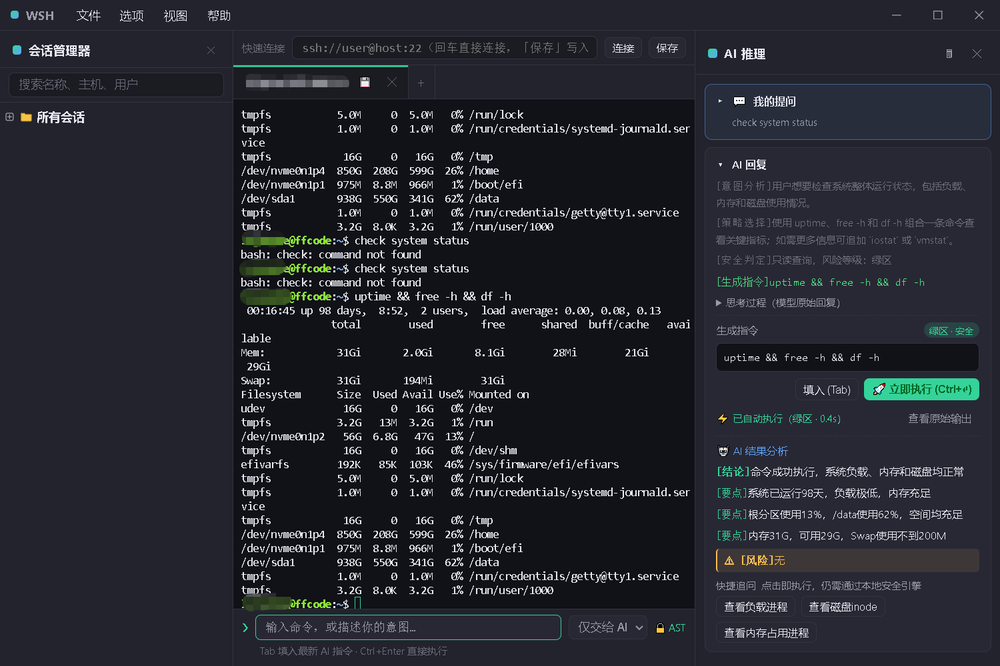

<h1 align="center">wsh</h1>

<p align="center">
  基于 Go + Web 的跨平台 SSH 客户端。<br/>
  <a href="README.md">English</a> | 中文
</p>

<p align="center">
  
</p>

后端用 Go 实现，界面是内嵌的 Web 前端（Xshell 风格：左侧停靠的会话管理器 +
多标签会话，文件传输 / 隧道各自独立成窗），终端用 xterm.js 渲染，由 Wails v3
封装为原生桌面窗口。

## 功能

- **会话管理器**（主窗口左侧停靠面板）— 文件夹 / 连接树 + 选中连接的属性面板，
  新建 / 重命名 / 删除都在这里；可像 Xshell 那样用面板右上角的 ✕ 收起，`Ctrl/Cmd+1` 再展开。
  双击连接在右侧打开终端标签页
- **拖放整理会话** — 连接可直接拖进 / 拖出文件夹（拖到「未分组」即移出），
  也能在同一个分组内拖拽排序；文件夹之间可以拖拽调顺序。所有调整立即落盘，重启后保持
- **多标签会话** — 主区域是多标签页终端，标签栏末尾的 ＋ 可新建连接；双击标签可重命名连接标题
- **快速连接** — 顶部地址栏直接输 `ssh://user@host:port` 回车即连（不保存），也可点「保存」写入连接列表；已打开的临时会话可在标签上点 💾 另存为连接
- **跳板机（多级）** — 连接可指定多台跳板机，按 `Local → 跳板 A → 跳板 B → 目标` 链路串联；配置环 / 缺失跳板会在拨号前报错
- **节点资源探针** — 有会话打开时，后台低频采集目标主机 CPU（load）、内存、磁盘并显示为迷你仪表盘；使用独立 SSH 通道，不干扰交互式 PTY
- **AI 推理窗格**（右侧）— 三栏布局的第三栏：思维链（CoT）流式卡片、错误根因分析（RCA）卡片、黄区命令的**影子推演**确认面板、被阻断命令的提示。可折叠，`Ctrl/Cmd+Shift+A` 显隐；会话变长后旧卡片自动收成一行结果摘要（悬停卡片的执行区会在终端里高亮对应输出，生成失败可一键重试）
- **Smart Input**（终端下方常驻）— 单框双轨：既可直接敲 Shell 命令，也可用自然语言描述意图（`帮我找出占用 8080 端口的进程` → 生成 `lsof -i :8080` 预览）；输入过程实时安全分类并高亮（绿/黄/红），红区命令禁用回车。`Ctrl+Enter` 生成并直接执行，`Esc` 是统一的「停下」键
- **本地安全引擎** — 基于 Go AST（`mvdan.cc/sh/v3`）而非正则：递归删除根目录、`dd of=/dev/sda`、`mkfs`、fork 炸弹等硬阻断（红区）；清空防火墙、停止服务、批量删除、提权（`sudo`/`doas`/`su`）需二次确认（黄区，影子推演确认后执行，可永久加入允许名单）；只读低风险命令直接下发（绿区）。**判定完全本地毫秒级完成，不依赖 LLM**
- **数据脱敏网关** — 上送 AI 的终端上下文与提问先在本地脱敏：IPv4/IPv6 → `[IP_MASKED]`，密码 / Token / API Key / JWT / 私钥块 → `[SENSITIVE_DATA]`
- **AI 推理（可选）** — 支持 OpenAI 兼容接口与本地 Ollama（完全离线）；API Key 加密落盘。未配置时全部 AI 功能静默关闭，终端不受影响；模型给出的命令一律经本地引擎复核后才可执行
- **连接管理** — 保存多台服务器，一键新建 / 编辑 / 删除 / 测试连接
- **密钥管理** — 提交并保存用户私钥（加密落盘），显示对应公钥与指纹；连接可引用密钥登录。口令默认不落盘，连接时询问（可选「记住口令」加密保存）
- **优先密钥登录** — 配置了密钥的连接登录时先用密钥认证，失败再回退到密码
- **密码保存** — 密码使用本机密钥 AES-GCM 加密后落盘，配置被拷走也无法解出明文
- **多窗口** — 文件传输 / 端口隧道 / 选项 / 密钥管理都在各自独立的窗口中打开，
  不占用会话窗口的空间，可单独关闭 / 重开
- **自绘窗口** — Windows/Linux 下窗口无系统边框，标题栏（品牌 / 菜单 / 窗口按钮）由
  前端绘制，整体风格与界面一致；macOS 保留系统边框与全局菜单
- **终端** — 多标签页 xterm.js 终端，随窗口自动调整 PTY 大小；亮色主题下终端配色也跟着变亮；
  连接失败时弹窗输入密码重试
- **文件传输** — 双栏 SFTP 浏览器，支持上传 / 下载文件；未保存密码的连接会先弹窗要密码
- **隧道管理** — 本地端口转发到远程地址，可启动 / 停止；同样支持连接时弹窗要密码

## 架构

```
Wails v3 桌面窗口 (跨平台 WebView 容器，窗口/菜单等桌面能力)
  └─ Go 后端 (复用 SSH / SFTP / 隧道 / 存储逻辑)
       ├─ internal/safety   本地 AST 安全引擎 (mvdan.cc/sh/v3)
       ├─ internal/sanitize 上送 AI 前的本地脱敏网关
       ├─ internal/ai       OpenAI 兼容 / Ollama 流式推理客户端
       └─ 本地 HTTP + WebSocket 服务 (仅绑定 127.0.0.1)
            └─ React 前端 (构建产物 go:embed 进单二进制，离线可跑)
                 ├─ 会话窗口
                 │    ├─ 左侧停靠的会话管理器 (连接树 + 属性 + 资源仪表盘)
                 │    ├─ 中间 xterm.js 终端 + 底部 Smart Input
                 │    └─ 右侧 AI 推理窗格 (CoT / RCA / 影子推演)
                 └─ 文件传输 / 端口隧道 / 选项 / 密钥管理窗口
```

所有窗口共享同一个后端服务，跨窗口的操作（比如从隧道窗口连到某台机器）通过
`session.open` 等 RPC 广播给会话窗口执行。

前后端通过 WebSocket 交换 JSON 消息（RPC），终端输出以流式推送，键盘输入走请求。
前端是 **React + Vite**（源码在 `frontend/`，构建产物输出到 `web/` 并被 `go:embed`
打包进可执行文件，运行时不需要 Node）；Wails 只充当窗口外壳，加载本地服务的 URL。

前端关键源码：

```
frontend/src/
  lib/rpc.js               WebSocket RPC 客户端（请求 + 推送订阅）
  lib/intent.js            单框双轨判据（Shell vs 自然语言）与风险标签
  state/store.jsx          全局状态（设置、连接、标签页、面板显隐、推理卡片、主机采样）
  components/              各页面与组件（会话树、终端、SmartInput、ReasonPane、SFTP、隧道、密钥…）
```

> `web/` 是构建产物，**不入库**（见 `.gitignore`）。所以 `go build` 前需要先构建
> 前端，否则窗口里会显示一个“前端未构建”的提示页。`./run.sh` 和 `./build.sh`
> 会自动先跑前端构建。

## 构建

需要 **Go 1.27+**、**bun**（构建前端）与平台 WebView 运行时（不再是纯 Go / 无 CGO）：

- **Windows** — 自带 WebView2 Runtime（Win10/11 已内置）；交叉编译需 mingw-w64
- **Linux** — 需 `libwebkit2gtk-4.1-dev`、`libgtk-3-dev`、`build-essential`、`pkg-config`
- **macOS** — 需 Xcode Command Line Tools（自带 WKWebView）

```bash
# Linux (Debian/Ubuntu 先装依赖)
sudo apt install libgtk-3-dev libwebkit2gtk-4.1-dev build-essential pkg-config
# 前端工具链
curl -fsSL https://bun.sh/install | bash

# 构建前端 + 后端并启动（弹出原生窗口）
./run.sh

# 手动：先构建前端，再编译后端
cd frontend && bun install && bun run build && cd ..
go build -o wsh .
```

### 前端开发（HMR 调试）

```bash
./dev.sh        # 后端(固定端口 17777) + Vite 开发服务器(5173)
```

然后在浏览器打开 <http://localhost:5173>：改前端代码即时热更新，无需重编译 Go。
Vite 会把 `/ws` 代理到后端。

### Windows（.exe）

Windows 版依赖 WebView2 Runtime（Win10/11 自带），交叉编译需要 mingw 工具链：

```bash
sudo apt install gcc-mingw-w64-x86-64   # 交叉工具链
./build.sh                              # 构建前端 + 生成 wsh.exe
```

> 应用图标（`build/icon.ico`）会以两种方式生效：`wsh.rc` 编译出的资源供资源管理器
> 与快捷方式使用；窗口/任务栏图标则由 `icon_windows.go` 在运行时设置。

### macOS（.app / .dmg）

macOS 版依赖系统自带的 WKWebView，**必须在 macOS 上构建**：Wails v3 需要 CGO 链接
Cocoa / WebKit，无法从 Linux / Windows 交叉编译。

```bash
xcode-select --install       # 首次需要命令行工具
./build.sh darwin            # 构建前端 + 打包 wsh.app
./build.sh dmg               # 再生成 wsh.dmg 安装镜像
```

> 未签名 / 未公证的包分发给别人时，对方首次打开需右键 →「打开」。

## 使用

启动后程序在 `127.0.0.1` 起一个本地服务（默认随机端口，`-port` 可固定），
并在 Wails 原生窗口中加载前端界面（`-no-open` 可只起服务不弹窗，便于调试）。
配置数据保存在系统配置目录下 `wsh/config.json`（密码与私钥均为加密后的密文），
机器密钥保存在同目录 `secret.key`。

菜单栏（自绘，位于标题栏内）：

- **文件** — 新建连接（`Ctrl/Cmd+N`）、退出（`Ctrl/Cmd+Q`）
- **选项** — 选项（`Ctrl/Cmd+Shift+,`）、密钥管理（`Ctrl/Cmd+Shift+K`）
- **视图** — 放大 / 缩小 / 重置缩放、会话管理器（`Ctrl/Cmd+1`）、文件传输（`Ctrl/Cmd+2`）、端口隧道（`Ctrl/Cmd+3`）、显示/隐藏 AI 推理窗格（`Ctrl/Cmd+Shift+A`）
- **帮助** — 关于 wsh、开发者工具（DevTools）

小贴士：

- 左侧面板单击连接选中，双击打开终端标签页；搜索框按名称 / 主机 / 用户过滤
- 快速连接支持 `ssh://user@host:port`、`user@host:port`、`host:port`、`user@host`、`host`
- 连接失败（无密码 / 密码错误）会弹窗让你输入密码后重试

## AI 推理（可选）

在「选项 → AI 推理」里配置，**不配置也完全可用**（终端、安全引擎、跳板机、探针都不依赖它）：

| 提供方             | Base URL 示例                                                  | 模型示例      |
| ------------------ | -------------------------------------------------------------- | ------------- |
| OpenAI 兼容接口    | `https://api.openai.com/v1`（或自建 one-api / vLLM / LocalAI） | `gpt-4o-mini` |
| Ollama（本地离线） | `http://127.0.0.1:11434`                                       | `qwen2.5:7b`  |

- API Key 使用与密码相同的 AES-GCM 方案加密后落盘，不回显明文；本地 Ollama 可留空
- 「终端报错时自动根因分析」开启后，输出里出现 `FATAL` / `Segmentation fault` / `Permission denied` / OOM 等特征时会自动请求一次 RCA
- 「不发送终端上下文」勾选后，请求里只包含你自己的提问
- 上送前一律脱敏（IP / 密码 / Token / JWT / 私钥块），且模型给出的命令会被本地安全引擎重新分类，模型对「风险等级」的说法不作数

## 参与

欢迎贡献！开发环境与 PR 流程见 [CONTRIBUTING.md](CONTRIBUTING.md)（英文）。
界面文案统一放在 i18n 词典（`frontend/src/lib/i18n/`）中。

## 安全

请勿公开提交安全漏洞，参见 [SECURITY.md](SECURITY.md)。

## 许可证

[MIT](LICENSE)
